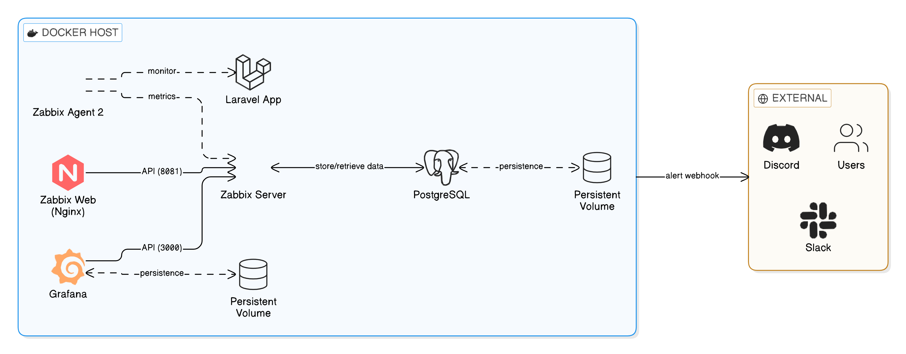

# Zabbix Docker Monitoring

A production-ready Docker-based Zabbix monitoring stack with Grafana, Discord/Slack alerts, and comprehensive monitoring capabilities.


## Features

- **Zabbix 7.0** with PostgreSQL backend
- **Grafana** with Zabbix datasource plugin
- **Discord & Slack** alert integration
- **Persistent volumes** for data safety
- **Health checks** on all services
- **Makefile** for easy operations
- **Docker host monitoring** via Zabbix Agent 2

## Architecture

<div align="center">
  
</div>

## Components

| Service | Port | Description |
|---------|------|-------------|
| Zabbix Web | 8081 | Zabbix web interface |
| Grafana | 3000 | Dashboards and visualization |
| Zabbix Server | 10051 | Monitoring server |
| Zabbix Agent | 10050 | Host monitoring agent |
| PostgreSQL | 5432 | Database (internal) |
| Laravel App | 8080 | Example application |

## Quick Start

### 1. Clone and configure

```bash
git clone https://github.com/salles-anderson/zabbix-docker-monitoring.git
cd zabbix-docker-monitoring

cp .env.example .env
# Edit .env with your settings
```

### 2. Start the stack

```bash
make up
```

Or without Make:

```bash
docker-compose up -d
```

### 3. Access services

| Service | URL | Credentials |
|---------|-----|-------------|
| Zabbix Web | http://localhost:8081 | Admin / zabbix |
| Grafana | http://localhost:3000 | admin / admin |
| Laravel App | http://localhost:8080 | - |

## Project Structure

```
.
├── docker-compose.yml
├── .env.example
├── Makefile
├── grafana/
│   └── provisioning/
│       ├── dashboards/
│       │   ├── dashboards.yml
│       │   └── json/
│       │       └── zabbix-overview.json
│       └── datasources/
│           └── zabbix.yml
├── zabbix/
│   ├── alertscripts/
│   │   ├── discord.sh
│   │   └── slack.sh
│   └── templates/
├── laravel/
│   └── Dockerfile
└── docs/
    └── architecture-diagram.png
```

## Alert Configuration

### Discord Alerts

1. Create a Discord webhook in your server
2. Add the webhook URL to `.env`:
   ```
   DISCORD_WEBHOOK_URL=https://discord.com/api/webhooks/YOUR_WEBHOOK
   ```
3. In Zabbix Web:
   - Go to **Administration > Media types**
   - Create new media type:
     - Name: `Discord`
     - Type: `Script`
     - Script name: `discord.sh`
     - Parameters: `{ALERT.SENDTO}`, `{ALERT.SUBJECT}`, `{ALERT.MESSAGE}`

### Slack Alerts

1. Create a Slack Incoming Webhook
2. Add the webhook URL to `.env`:
   ```
   SLACK_WEBHOOK_URL=https://hooks.slack.com/services/YOUR/SLACK/WEBHOOK
   ```
3. In Zabbix Web:
   - Go to **Administration > Media types**
   - Create new media type:
     - Name: `Slack`
     - Type: `Script`
     - Script name: `slack.sh`
     - Parameters: `{ALERT.SENDTO}`, `{ALERT.SUBJECT}`, `{ALERT.MESSAGE}`

## Makefile Commands

```bash
make help      # Show all commands
make up        # Start all services
make down      # Stop all services
make restart   # Restart services
make logs      # View all logs
make logs s=zabbix-server  # View specific service logs
make ps        # List containers
make health    # Check services health
make status    # Show detailed status
make backup    # Backup database
make restore f=backup.sql  # Restore database
make clean     # Remove all containers and volumes
make shell-zabbix   # Access Zabbix server shell
make shell-grafana  # Access Grafana shell
make shell-db       # Access PostgreSQL shell
```

## Environment Variables

| Variable | Default | Description |
|----------|---------|-------------|
| `POSTGRES_USER` | zabbix | Database user |
| `POSTGRES_PASSWORD` | zabbix | Database password |
| `POSTGRES_DB` | zabbix | Database name |
| `ZBX_HOSTNAME` | docker-host | Zabbix agent hostname |
| `GF_SECURITY_ADMIN_USER` | admin | Grafana admin user |
| `GF_SECURITY_ADMIN_PASSWORD` | admin | Grafana admin password |
| `DISCORD_WEBHOOK_URL` | - | Discord webhook for alerts |
| `SLACK_WEBHOOK_URL` | - | Slack webhook for alerts |

## Monitoring Host Docker

The Zabbix Agent 2 is configured to monitor the Docker host with access to:

- CPU, Memory, Disk metrics
- Docker containers status
- Network statistics
- System processes

## Backup & Restore

```bash
# Create backup
make backup

# Restore from backup
make restore f=backups/zabbix_backup_20240117_120000.sql
```

## Security Recommendations

- Change default passwords in `.env`
- Use secrets management in production
- Configure firewall rules
- Enable HTTPS with reverse proxy
- Restrict network access

## Troubleshooting

### Check service status
```bash
make health
docker-compose ps
```

### View logs
```bash
make logs s=zabbix-server
make logs s=grafana
```

### Restart specific service
```bash
docker-compose restart zabbix-server
```

## Author

**Anderson Sales** - DevOps Cloud Engineer

[](https://www.linkedin.com/in/salesanderson)
